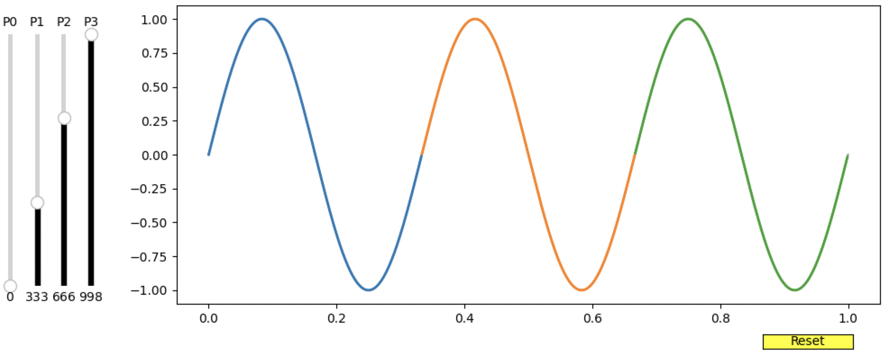

In order to run `patchviewer` simply clone this repository on your system using 
```
git clone https://github.com/srijaniiserprinceton/patchviewer.git
```
Open an `IPython` terminal in your `patchviewer` directory and run the widget script as
```
run interact_patches.py
```
Below is a simple demonstration of what the widget should look like for a single time (or longitude) series.


P0 through P4 indicate the different anchor points for coloring the lineplot. 
